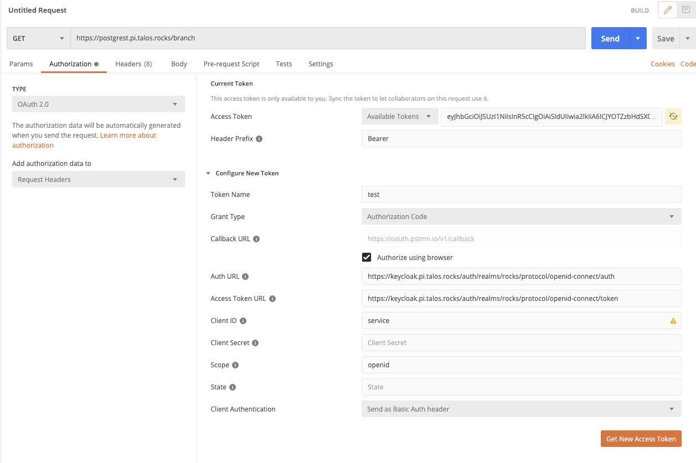

# Postman oAuth Setup

To setup Postman to allow cli test calls use the settings below:
* Grant Type: Authorization Code
* Callback URL (empty): enable Authorize using browser
* Auth URL: https://keycloak.pi.talos.rocks/auth/realms/rocks/protocol/openid-connect/auth
* Access Token URL: https://keycloak.pi.talos.rocks/auth/realms/rocks/protocol/openid-connect/token
* Scope: openid
* Client Authentication: Send as Basic Auth Header

The last two settings are dependent on the service being called. Generally you will not need a client secret but the ID 
should match the service being tested.
* Client ID
* Client Secret

