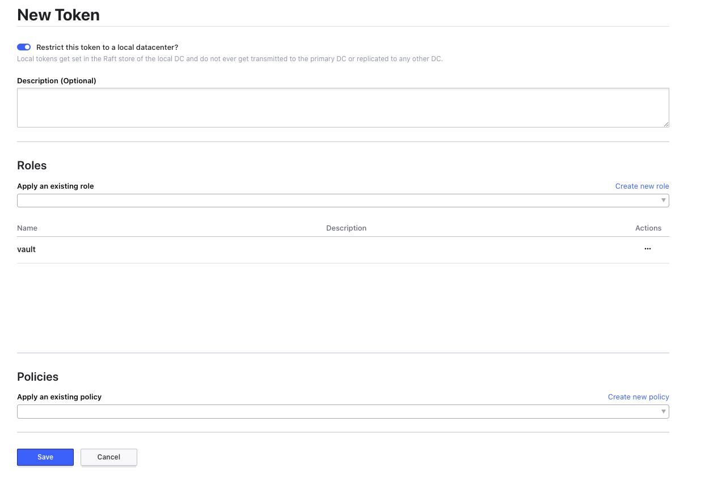
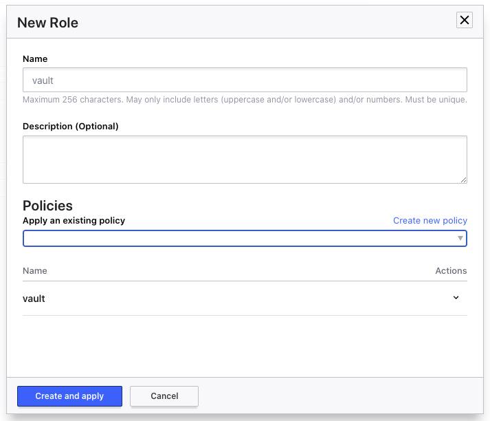

# Bootstrap Consul on Kubernetes Cluster


Setup Consul
```bash
helm repo add hashicorp https://helm.releases.hashicorp.com
kubectl create ns consul
kubectl -n consul create secret generic consul-gossip-encryption-key --from-literal=key=$(consul keygen)
helm -n consul install consul -f cluster/consul/bootstrap.yaml hashicorp/consul
```

Get the bootstrap token for authenticating to Consul

```bash
kubectl -n consul get secrets consul-bootstrap-acl-token -o json | jq -cr .data.token | base64 -d
```


Enable port forwarding so that you can connect to the Consul UI

```bash
kubectl -n consul port-forward service/consul-server 8500:8500
```

Go to the ACL / Polices page [http://localhost:8500/ui/talospi/acls/policies/create](http://localhost:8500/ui/talospi/acls/policies/create) 
and create a policy for Vault and set it to vaild for the current data centre (talospi)

```hcl
{
  "key_prefix": {
    "vault/": {
      "policy": "write"
    }
  },
  "node_prefix": {
    "": {
      "policy": "write"
    }
  },
  "service": {
    "vault": {
      "policy": "write"
    }
  },
  "agent_prefix": {
    "": {
      "policy": "write"
    }
  },
  "session_prefix": {
    "": {
      "policy": "write"
    }
  }
}
```

Then go to tokens and create a token for vault restricted to this datacenter for the role vault





