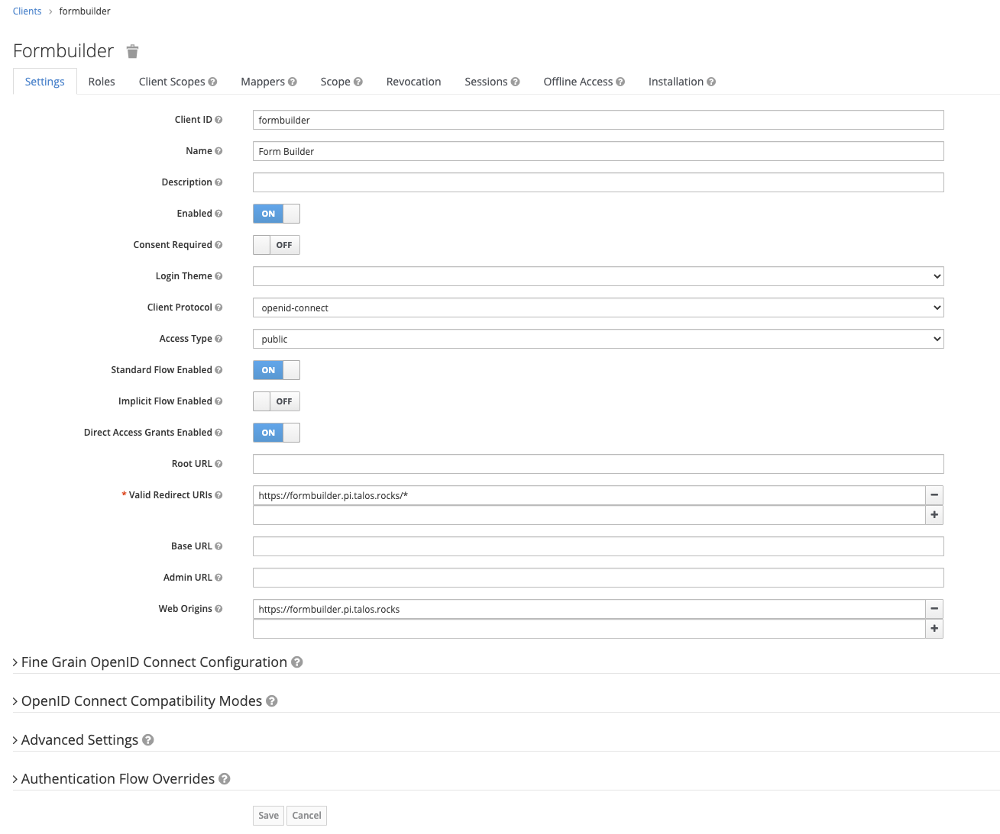

# Form API Server & Builder


## Stage 1 - FormAPI

#### - Step 1 Create a database

Enter the postgres pod using the command below then enter the SQL commands to create the database, user and grant the 
user permissions.

`kubectl -n databases exec -it postgresql-0 sh`


```sql
CREATE DATABASE formapi;
create user formapi with encrypted password 'CHANGE_ME';
grant all privileges on database formapi to formapi;
```

store a copy of the password to a file called `formapiDbPassword` for use later


#### Step 2 - Keycloak

In Keycloak setup a new client called `formapi` as *beareronly*


Then create a new user called `formapiadmin`. Give the user a password and store a copy of the password in a file called *formApiKeycloakAdminPassword*

Once you have created the user go to the *Role Mappings* tab and assign the following client roles:
* query-realms
* view-clients
* view-realm
* view-users


Lastly go to roles and add a role called *form-admin*


#### Step 3 - FormAPI

Create a kubernetes secret for FormAPI with the settings

```bash
kubectl create secret generic formapi --from-file=dbFormPassword=./formapiDbPassword --from-literal=keycloakAdminUsername=formapiadmin --from-file=keycloakAdminPassword=./formApiKeycloakAdminPassword
```


#### Step 4 - Deploy the service

```bash
helm install formapi helm/formapi
```


## Stage 2 - Form Builder

#### Step 1 - Keycloak

In Keycloak setup a new client called `formbuilderservice` as *confidential*, also set a valid redirect url


On the Credentials tab, grab the secret as this is needed to update the appConfig.json.

You also need to setup a public client called formbuilder`



Form Builder uses the following roles which must be setup via the roles tab:
* formbuilder-readonly
* formbuilder-promotion
* formbuilder-edit

You can alter the names of the roles if you wish, but you must make the corresponding changes to the appConfig.json.


#### Step 2 - appConfig.json

Form Builder uses an application config file in JSON format. A sample is here below:

*appConfig.json*
```json
{
  "environments": [
    {
      "id": "tdev",
      "label": "TalosPI Dev",
      "url": "https://formapi.pi.talos.rocks",
      "description": "Talos Rocks - Dev Environment",
      "service": {
        "keycloak": {
          "tokenUrl": "https://keycloak.pi.talos.rocks/auth/realms/rocks/protocol/openid-connect/token",
          "clientId": "formbuilderservice",
          "secret": "SECRET HERE"
        }
      },
      "editable": true,
      "reverse-proxies" : [
        {
          "path" : "/tdev/refdata/**",
          "url" : "http://postgrest.default.svc.cluster.local",
          "pathRewrite" : {
            "^/tdev/refdata" : ""
          }
        },
        {
          "path": "/tdev/files/**",
          "url": "http://attachments.default.svc.cluster.local",
          "pathRewrite": {
            "^/tdev/files": "/files"
          }
        },
        {
          "path" : "/tdev/form/**",
          "url" : "http://formapi.default.svc.cluster.local",
          "pathRewrite" : {
            "^/tdev/form" : "/form"
          }
        }
      ]
    }
  ],
  "gov-uk-enabled" : true,
  "legacy-migration": true,
  "keycloak": {
    "authUrl": "https://keycloak.pi.talos.rocks/auth",
    "clientId": "formbuilder",
    "realm": "rocks",
    "access-roles": ["formbuilder-readonly"],
    "promotion-roles": ["formbuilder-promotion"],
    "edit-roles": ["formbuilder-edit"]
  }
}
```

Update the sample above, correcting the secret, roles and urls as appropriate for your environment. Save the contents to
a file called appConfig.json. Then run the following command to create the kubernetes secret:

`kubectl create secret generic formbuilder --from-file='appConfig.json=./appConfig.json'`


#### Step 4 - Deploy FormBuilder

`helm install formbuilder helm/formbuilder`
