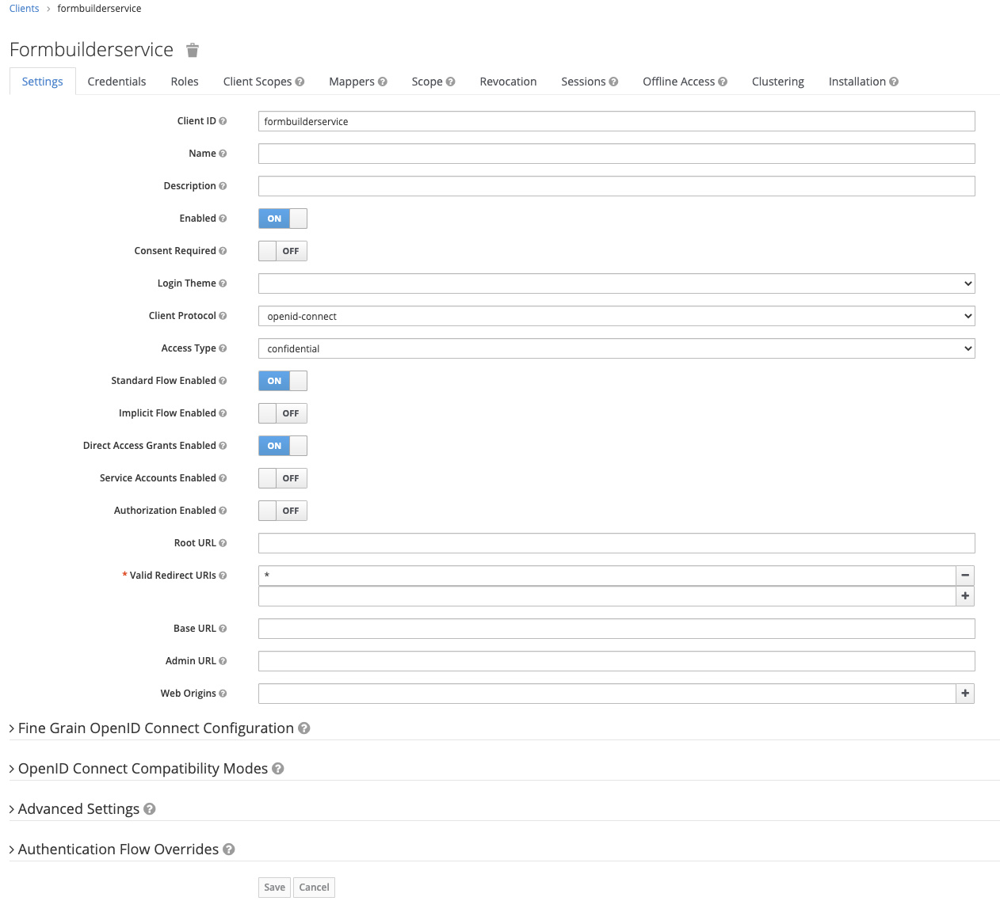

# Form API Server & Builder


## Stage 1 - FormAPI

#### - Step 1 Create a database

Enter the postgres pod using the command below then enter the SQL commands to create the database, user and grant the 
user permissions.

`kubectl -n databases exec -it postgresql-0 sh`


```sql
CREATE DATABASE formapi;
create user formapi with encrypted password 'CHANGE_ME';
grant all privileges on database formapi to formapi;
```

store a copy of the password to a file called `formapiDbPassword` for use later


#### Step 2 - Keycloak

In Keycloak setup a new client called `formapi` as *beareronly*


Then create a new user called `formapiadmin`. Give the user a password and store a copy of the password in a file called *formApiKeycloakAdminPassword*

Once you have created the user go to the *Role Mappings* tab and assign the following client roles:
* query-realms
* view-clients
* view-realm
* view-users


Lastly go to roles and add a role called *form-admin*


#### Step 3 - FormAPI

Create a kubernetes secret for FormAPI with the settings

```bash
kubectl create secret generic formapi --from-file=dbFormPassword=./formapiDbPassword --from-literal=keycloakAdminUsername=formapiadmin --from-file=keycloakAdminPassword=./formApiKeycloakAdminPassword
```


#### Step 4 - Deploy the service

```bash
helm install formapi helm/formapi
```


## Stage 2 - Form Builder

#### Step 1 - Keycloak

In Keycloak setup a new client called `formbuilderservice` as *confidential*, also set a valid redirect url



On the Credentials tab, grab the secret as this is needed to update the appConfig.json.

Form Builder uses the following roles which must be setup via the roles tab:
* formbuilder-readonly
* formbuilder-promotion
* formbuilder-edit

You can alter the names of the roles if you wish, but you must make the corresponding changes to the appConfig.json.


