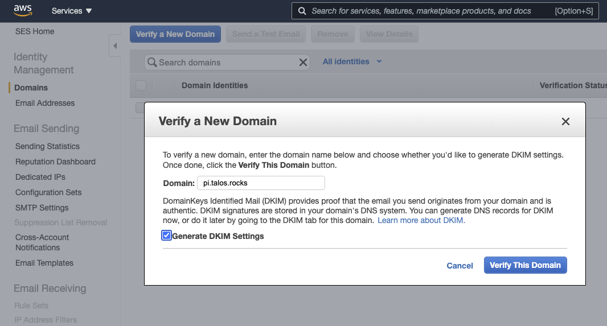
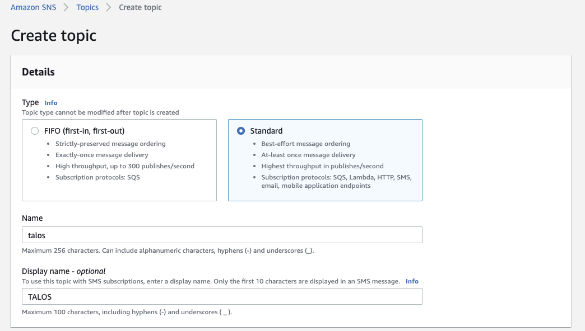
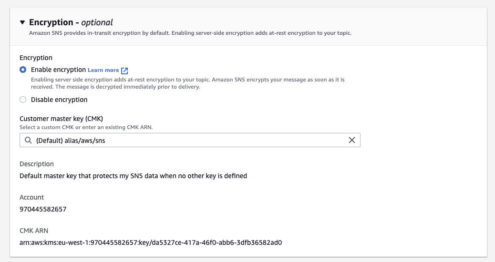
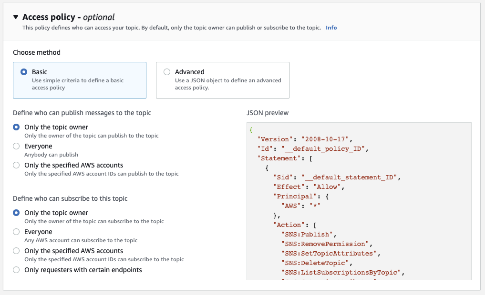
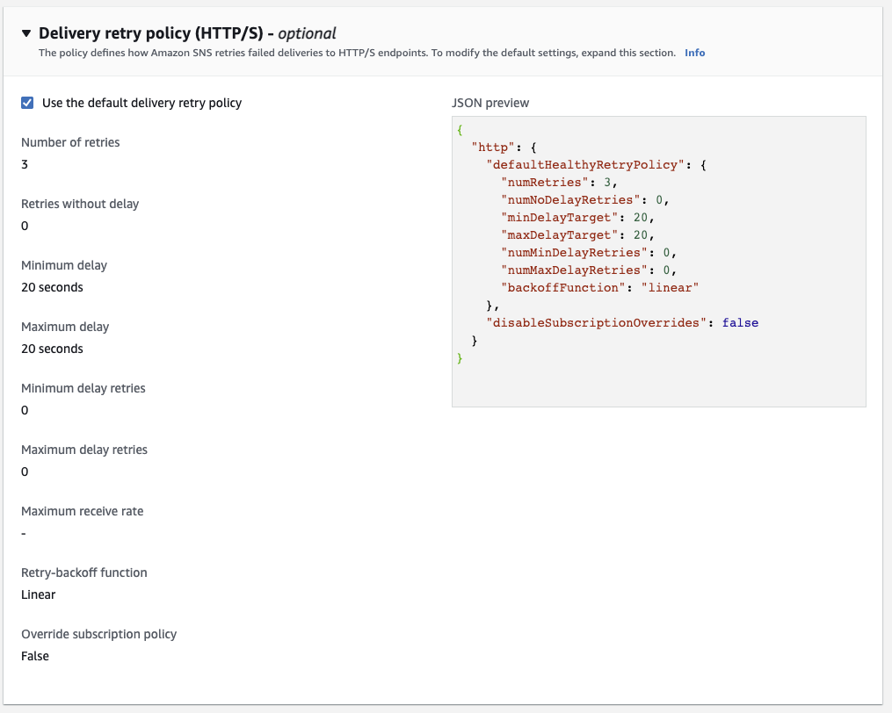
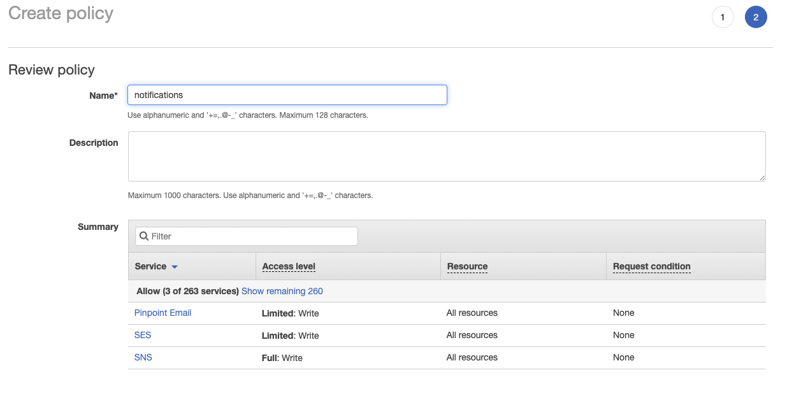
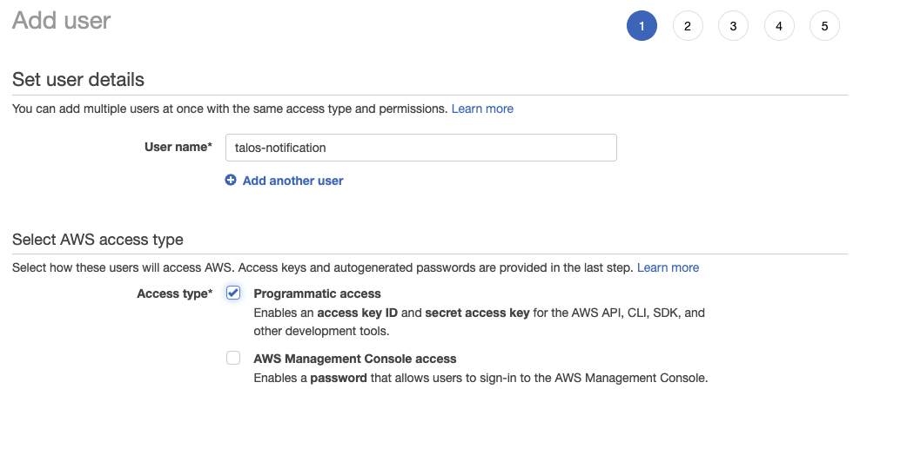
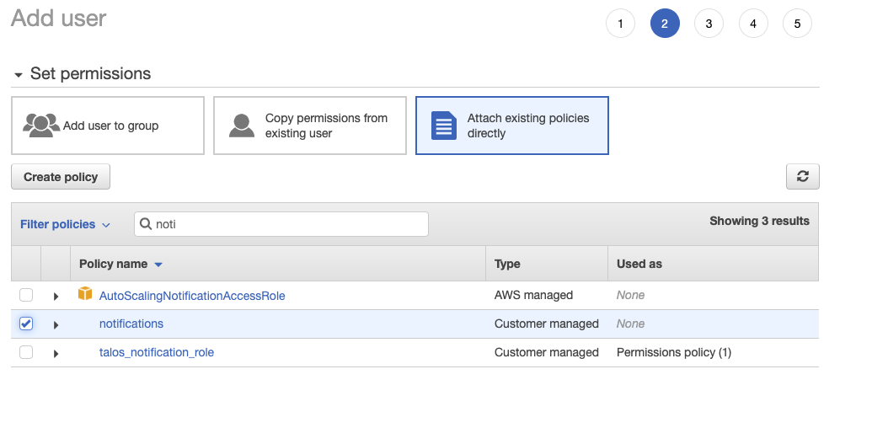
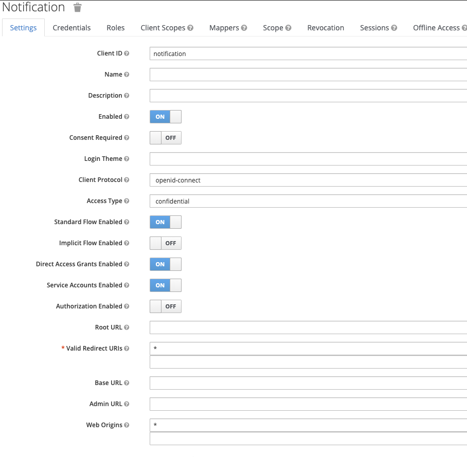

### Workflow Notification Services

Workflow Notification services is an enterprise feature of the Talos platform.

It requires the following services:
* RabbitMQ
* AWS SMS/SNS setup

 
### AWS SES setup
 
 
To be able to send emails via SES the following steps need to be followed within Amazon:
 
 
##### Create and verify your domain

In AWS eu-west-2 create and verify your domain name (this allows AWS to send email on your domains behalf)
 



Currently eu-west-2 does not allow for SMS messages. As such you must create an SNS topic under eu-west-1.




 
 
##### Create IAM Policy
 
Under IAM policies create the following policy: *notification*

```json
{
    "Version": "2012-10-17",
    "Statement": [
        {
            "Effect": "Allow",
            "Action": [
                "ses:SendEmail",
                "ses:SendRawEmail"
            ],
            "Resource": "*"
        },
        {
            "Effect": "Allow",
            "Action": [
                "sns:DeleteTopic",
                "ses:SendRawEmail",
                "sns:CreatePlatformApplication",
                "sns:SetSMSAttributes",
                "sns:CreateTopic",
                "sns:CreatePlatformEndpoint",
                "sns:Unsubscribe",
                "sns:SetTopicAttributes",
                "sns:OptInPhoneNumber",
                "sns:DeleteEndpoint",
                "ses:SendEmail",
                "sns:SetEndpointAttributes",
                "sns:SetSubscriptionAttributes",
                "sns:Publish",
                "sns:DeletePlatformApplication",
                "sns:SetPlatformApplicationAttributes",
                "sns:Subscribe",
                "sns:ConfirmSubscription"
            ],
            "Resource": "*"
        }
    ]
}
```


 
 
##### Create an IAM user
 





#### Vault setup

Create a policy in Vault for the notification gateway and apply the token given as a kubernetes secret. 
Replace *<VAULT_TOKEN>* with the root vault token. `export ENV=dev` Where the environment is 'Development (dev)' or 
'Production (prod)'. For other environments you will need to update the policy hcl file to match.

```bash
kubectl -n vault port-forward service/vault 8200:8200
export VAULT_ADDR="https://127.0.0.1:8200"
export VAULT_TOKEN="<VAULT_TOKEN>"
vault policy write -tls-skip-verify notification-services cluster/policies/notification-${ENV}.hcl
vault token create -tls-skip-verify -period=8760h -policy=notification-services -explicit-max-ttl=8760h
kubectl create secret generic notification --from-literal=token=$TOKEN
```


You need to ensure you have registry credential setup in the environment that allow access to docker hub. 
This can be done with the following command:

```bash
kubectl create secret docker-registry regcred --docker-server=https://index.docker.io/v1/ \
 --docker-username=<your-name> --docker-password=<your-pword> --docker-email=<your-email>
```


##### Keycloak Setup

Within keycloak you need a ClientID/Secret. Below are the settings for each:

###### ClientID



You also need to grab the Client Secret from the second tab.


##### Vault Secret setup

In Vault two sets of secrets are required. The application will read most of the settings from the shared config secret.
[talos_config](talos_config.md)

In addition, you need to create a new secret in the secrets key value store under the path
*talos-engine/$ENV* 

[https://localhost:8200/ui/vault/secrets/secret/list](https://localhost:8200/ui/vault/secrets/secret/list)

```json
{
  "amazon.notify.enabled": true,
  "api.allowedAudiences": "camunda-rest-api",
  "auth.clientId": "notification",
  "auth.clientSecret": "<CHANGEME>",
  "aws.ses.access.key": "<CHANGEME>",
  "aws.ses.from.address": "support@pi.talos.rocks",
  "aws.ses.secret.key": "<CHANGEME>",
  "aws.sns.access.key": "<CHANGEME>",
  "aws.sns.secret.key": "<CHANGEME>",
  "blob.storage.access.key": "<CHANGEME>",
  "blob.storage.bucket.pdfs": "<CHANGEME>-pdfs",
  "blob.storage.endpoint": "https://s3.eu-west-2.amazonaws.com",
  "blob.storage.region": "eu-west-2",
  "blob.storage.secret.key": "<CHANGEME>",
  "rabbitmq.password": "<CHANGEME>",
  "rabbitmq.servers": "rabbitmq-rabbitmq-server-0.rabbitmq-rabbitmq-headless.rabbitmq.svc.cluster.local:5672,rabbitmq-rabbitmq-server-1.rabbitmq-rabbitmq-headless.rabbitmq.svc.cluster.local:5672,rabbitmq-rabbitmq-server-2.rabbitmq-rabbitmq-headless.rabbitmq.svc.cluster.local:5672",
  "rabbitmq.username": "notification"
}
```


##### Deploy to cluster

Install the notification gateway to the cluster

```bash
helm install notificationservices helm/notificationservices
```
