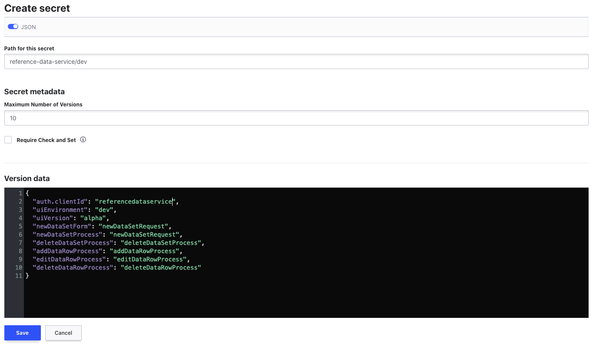

### Workflow Supporting Services

Workflow supporting services is an enterprise feature of the Talos platform.

It requires the following services:
* Consul
* Postgres
* Talos Engine
* MongoDB


` kubectl -n databases exec -it postgresql-0 psql`


```sql
create database supportingservices;
create user supporting_services_admin with encrypted password 'CHANGE_ME';
grant all privileges on database supportingservices to supporting_services_admin;
```


Keycloak - Client Scope:
* supporting-services
    -> audience mapper: supporting-services
 

Consul Policy - supportingservices
```hcl
node_prefix "" {
  policy = "write"
}
service_prefix "" {
  policy = "read"
}
key_prefix "camel" {
  policy = "write"
}
agent_prefix "" {
  policy = "read"
}
session_prefix "" {
  policy = "write"
}
```

#### Vault setup

Create a policy in Vault for the supportingservices and apply the token given as a kubernetes secret. 
Replace *<VAULT_TOKEN>* with the root vault token. `export ENV=dev` Where the environment is 'Development (dev)' or 
'Production (prod)'. For other environments you will need to update the policy hcl file to match.

```bash
kubectl -n vault port-forward service/vault 8200:8200
export VAULT_ADDR="https://127.0.0.1:8200"
export VAULT_TOKEN="<VAULT_TOKEN>"
vault policy write -tls-skip-verify supporting-services cluster/policies/supporting-services-${ENV}.hcl
vault token create -tls-skip-verify -period=8760h -policy=supporting-services -explicit-max-ttl=8760h
kubectl create secret generic supportingservices --from-literal=token=$TOKEN
```


You need to ensure you have registry credential setup in the environment that allow access to docker hub. 
This can be done with the following command:

```bash
kubectl create secret docker-registry regcred --docker-server=https://index.docker.io/v1/ \
 --docker-username=<your-name> --docker-password=<your-pword> --docker-email=<your-email>
```

##### Vault Secret setup

In Vault two sets of secrets are required. The application will read most of the settings from the shared config secret.
[talos_config](talos_config.md)

In addition, you need to create a new secret in the secrets key value store under the path
*talos-engine/$ENV* 

[https://localhost:8200/ui/vault/secrets/secret/list](https://localhost:8200/ui/vault/secrets/secret/list)

```json
{
  "api.allowedAudiences": "support-services",
  "consul.acl-token": "<CHANGEME>",
  "database.password": "<CHANGEME>",
  "database.url": "jdbc:postgresql://postgresql.databases.svc.cluster.local:5432/supportingservices?sslmode=prefer&currentSchema=public",
  "database.username": "supporting_services_admin"
}
```





Install the Reference data service UI to the cluster

##### Enterprise version

```bash
helm install supportingservices helm/supportingservices
```
