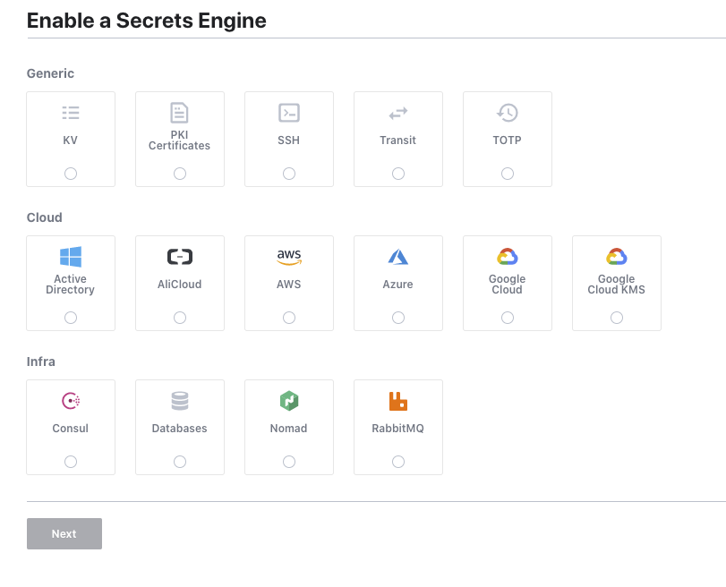
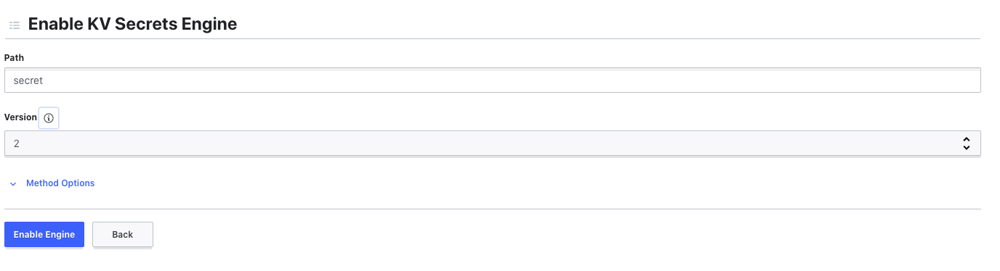

# Talos Config Service

To ensure a consistent and secure approach to configuration for the Talos services we created a config service which 
uses Vault as its backend.

This is released as a private docker container, as such you need a docker registry secret within you namespace.

```bash
kubectl -n vault create secret docker-registry regcred --docker-server=https://index.docker.io/v1/ \
 --docker-username=<your-name> --docker-password=<your-pword> --docker-email=<your-email>
```


Create a policy in Vault for the configservice and apply the token given as a kubernetes secret. Replace *<VAULT_TOKEN>*
with the root vault token.

```bash
kubectl -n vault port-forward service/vault 8200:8200 &
export VAULT_ADDR="https://127.0.0.1:8200"
export VAULT_TOKEN="<VAULT_TOKEN>"
vault policy write -tls-skip-verify config-server cluster/policies/config-server.hcl
vault token create -tls-skip-verify -period=8760h -policy=config-server -explicit-max-ttl=8760h
kubectl -n vault create secret generic config-server --from-literal=token=$TOKEN
```

Install the config service to the cluster

```bash
helm -n vault install configservice helm/configservice
```


Create a new KV keystore version 2 called *secrets*






Once the keystore is created; then create a new secret under the *secret* path called *config-service/$ENV* where $ENV 
is 'dev' for Development or 'prod' for Production. The secret should then contain the following sample json.


```json
{
  "auth.realm": "rocks",
  "auth.url": "https://keycloak.pi.talos.rocks",
  "businessKeyUrl": "https://formapi.pi.talos.rocks/form/keys/businessKey",
  "consul.datacenter": "dc1",
  "consul.url": "https://consul-server:8501",
  "fileUploadApi.url": "https://fileuploadservice.pi.talos.rocks",
  "formApi.url": "https://formapi.pi.talos.rocks",
  "notificationApi.url": "https://notification.default.svc.cluster.local",
  "openapi.docs.enabled": true,
  "realtimeProcessDashboard.url": "https://talosprocessdashboard.pi.talos.rocks",
  "refData.url": "https://postgrest.pi.talos.rocks",
  "server-port": "8443",
  "ssl.enabled": "true",
  "swagger.auth.realm": "master",
  "tracing.enabled": true,
  "tracing.zipkin.baseUrl": "http://zipkin.default.svc.cluster.local:9411",
  "workflowApi.url": "https://talosengine.pi.talos.rocks"
}
```
