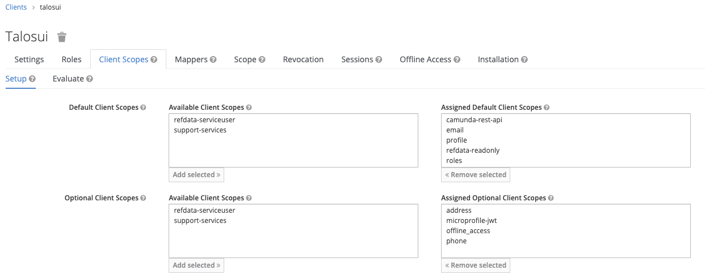

### Portal UI

The enterprise Talos version of the portal uses the Talos config service for its secrets; The opensource
version uses AWS Secrets manager. To use the open source version replace the Vault steps below with the appropriate
setup steps for secrets manager, ensuring there is a set of AWS access credentials that has access to the required 
secret.

#### Keycloak setup

The Reference data UI requires a public Keycloak client to be created called *talosui*


Ensure the both the *refdata-readonly*, *camunda-rest-api* and *user* client scopes are added to the client.


#### Vault setup

Create a policy in Vault for the talosui and apply the token given as a kubernetes secret. 
Replace *<VAULT_TOKEN>* with the root vault token. `export ENV=dev` Where the environment is 'Development (dev)' or 
'Production (prod)'. For other environments you will need to update the policy hcl file to match.

```bash
kubectl -n vault port-forward service/vault 8200:8200 &
export VAULT_ADDR="https://127.0.0.1:8200"
export VAULT_TOKEN="<VAULT_TOKEN>"
vault policy write -tls-skip-verify talos-ui cluster/policies/talos-ui-${ENV}.hcl
vault token create -tls-skip-verify -period=8760h -policy=talos-ui -explicit-max-ttl=8760h
kubectl create secret generic talosui --from-literal=token=$TOKEN
```


If you are using the enterprise version you need to ensure you have registry credential setup in the environment that
allow access to docker hub. This can be done with the following command:

```bash
kubectl create secret docker-registry regcred --docker-server=https://index.docker.io/v1/ \
 --docker-username=<your-name> --docker-password=<your-pword> --docker-email=<your-email>
```

##### Vault Secret setup

In Vault two sets of secrets are required. The application will read most of the settings from the shared config secret.
[talos_config](talos_config.md)

In addition, you need to create a new secret in the secrets key value store under the path
*talos-ui/$ENV* 


*talos-ui/dev*
```json
{
  "admin.role": "process_admin",
  "auth.clientId": "talosui",
  "reports.precog.name": "Precog Command Center",
  "reports.precog.roles": "precog-dashboard",
  "reports.precog.url": "https://precogdashboard.pi.talos.rocks",
  "support.processKey": "talosSupport",
  "tracing.zipkin.ui.url": "https://zipkin.pi.talos.rocks",
  "uiEnvironment": "dev",
  "uiVersion": "ALPHA"
}
```


##### Enterprise version


Install the UI to the cluster

```bash
helm install talosui helm/talosengine
```
